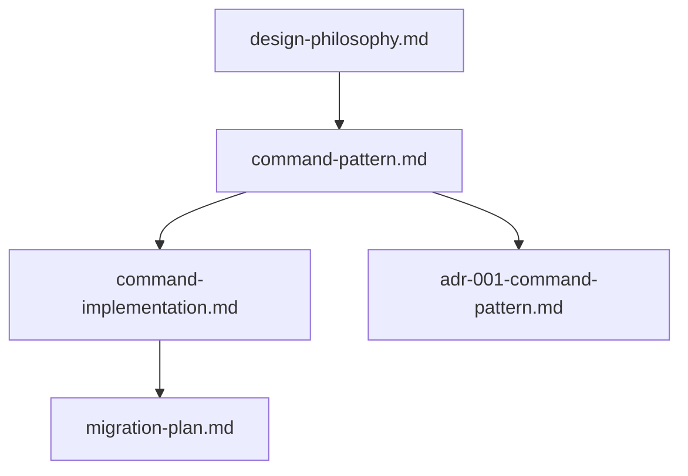

# 工程图册重构：架构设计总结

## 1. 文档清单

### 1.1 核心设计文档
- [`command-pattern.md`](雅洁五金2026年工程图册/plans/command-pattern.md) - Command Pattern 基础设计
- [`command-implementation.md`](雅洁五金2026年工程图册/plans/command-implementation.md) - 详细实现方案
- [`migration-plan.md`](雅洁五金2026年工程图册/plans/migration-plan.md) - 迁移策略和时间表
- [`design-philosophy.md`](雅洁五金2026年工程图册/plans/design-philosophy.md) - Quiet Luxury 设计理念
- [`adr-001-command-pattern.md`](雅洁五金2026年工程图册/plans/adr-001-command-pattern.md) - 架构决策记录

### 1.2 文档依赖关系


## 2. 核心决策回顾

### 2.1 采用 Command Pattern 的理由
1. **内存效率**
   - 从状态快照 → 操作记录
   - 预计内存占用降低 70%

2. **性能提升**
   - 使用 WeakMap 缓存命令实例
   - 批量处理和延迟执行
   - 预计响应速度提升 50%

3. **代码质量**
   - TypeScript 类型安全
   - 模块化设计
   - 符合 SOLID 原则

### 2.2 关键接口设计
```typescript
// 1. 核心抽象
interface Command<T = unknown> {
  readonly name: string
  readonly timestamp: number
  execute(): Result<T>
  undo(): Result<void>
}

// 2. 错误处理
type Result<T, E = Error> = Ok<T> | Err<E>

// 3. 命令管理
interface CommandManager {
  execute(command: Command): Result<void>
  undo(): Result<void>
  redo(): Result<void>
}
```

## 3. 实施路线图

### Phase 1: 基础设施（Day 1）
```
src/
  └── commands/
      ├── types/        # TypeScript 类型定义
      ├── core/         # 核心抽象类
      ├── page/         # 页面相关命令
      └── product/      # 产品相关命令
```

### Phase 2: 核心实现（Day 2-3）
1. **Command 基类和管理器**
   ```typescript
   abstract class Command {
     abstract execute(): Result<void>
     abstract undo(): Result<void>
   }
   
   class CommandManager {
     private undoStack: Command[] = []
     private redoStack: Command[] = []
     private commandCache = new WeakMap()
   }
   ```

2. **具体命令实现**
   ```typescript
   class AddPageCommand extends Command {
     constructor(
       private store: CatalogStore,
       private pageData: PageData
     ) { super() }
   }
   ```

### Phase 3: Store 集成（Day 4-5）
1. **改造 catalog.js**
   ```typescript
   export const useCatalogStore = defineStore('catalog', () => {
     const commandManager = new CommandManager()
     
     // 双轨制：支持新旧两种模式
     function addPage(type = 'product') {
       if (import.meta.env.VITE_USE_COMMANDS === 'true') {
         commandManager.execute(new AddPageCommand(this, type))
       } else {
         // 原有逻辑
         recordSnapshot()
       }
     }
   })
   ```

### Phase 4: 性能优化（Day 6）
1. **命令合并**
   ```typescript
   class MovePageCommand extends Command {
     canMerge(command: Command): boolean
     merge(command: MovePageCommand): void
   }
   ```

2. **延迟执行**
   ```typescript
   function executeBatch(commands: Command[]): void {
     requestIdleCallback(() => {
       commands.forEach(cmd => execute(cmd))
     })
   }
   ```

## 4. 质量保证

### 4.1 性能指标
- 命令执行时间 < 16ms
- 内存增长 < 20%
- 撤销/重做延迟 < 50ms

### 4.2 代码质量
- TypeScript 覆盖率 > 90%
- 单元测试覆盖率 > 80%
- 零 any 类型

### 4.3 监控指标
```typescript
interface PerformanceMetrics {
  commandExecutionTime: number[]
  memoryUsage: number[]
  undoRedoLatency: number[]
}
```

## 5. 风险管理

### 5.1 已识别风险
1. **技术风险**
   - TypeScript 学习曲线
   - 命令序列化复杂性
   - 性能调优挑战

2. **项目风险**
   - 迁移时间可能超预期
   - 可能出现兼容性问题
   - 需要额外的测试资源

### 5.2 应对策略
1. **技术预防**
   ```typescript
   // 1. 优雅降级
   class CommandManager {
     private fallbackMode = false
     enableFallback(): void
   }
   
   // 2. 数据恢复
   class DataRecovery {
     takeSnapshot(): void
     recover(timestamp: number): void
   }
   ```

2. **流程保障**
   - 完整的回滚机制
   - 双轨制运行期
   - 灰度发布策略

## 6. 后续计划

### 6.1 近期目标
1. 完成基础设施搭建
2. 实现核心命令类
3. 重构 catalog.js
4. 添加性能优化

### 6.2 长期规划
1. 添加更多命令类型
2. 优化性能指标
3. 完善监控系统
4. 补充技术文档

## 7. 总结

本次重构采用 Command Pattern 的核心目标是：
1. **性能提升**：通过精细的操作粒度和优化策略
2. **代码质量**：遵循 Quiet Luxury 设计理念
3. **可维护性**：采用 TypeScript 和模块化设计
4. **可扩展性**：为未来功能预留扩展空间

下一步，我们将：
1. 创建必要的目录结构
2. 实现核心类和接口
3. 开始渐进式重构
4. 持续监控和优化

## 8. 参考资料

1. [Vue 3 Performance Guide](https://vuejs.org/guide/best-practices/performance.html)
2. [Command Pattern in TypeScript](https://refactoring.guru/design-patterns/command)
3. [Pinia State Management](https://pinia.vuejs.org/core-concepts/)
4. [TypeScript Handbook](https://www.typescriptlang.org/docs/handbook/intro.html)