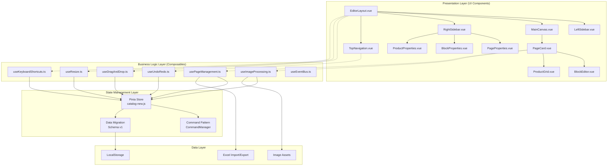

# 雅洁五金 2026 - UI 重构技术规格说明书

## 文档信息
- **项目名称**: 雅洁五金 2026 工程图册 UI 重构
- **文档版本**: v1.0
- **创建日期**: 2026-03-03
- **最后更新**: 2026-03-03
- **文档状态**: 技术设计完成 ✅

## 1. 执行摘要

### 1.1 项目背景
雅洁五金 2026 工程图册项目已完成底层架构重构，实现了基于 Pinia + 命令模式的状态管理和数据迁移系统。当前需要在前端 UI 层面进行现代化升级，以提供更专业、更高效的编辑体验。

### 1.2 重构目标
1. **用户体验升级**: 从单页应用升级为专业级三栏式编辑界面
2. **视觉设计现代化**: 应用 Quiet Luxury 设计语言，体现高级工业感
3. **代码架构优化**: 实现组件化、模块化，提升可维护性
4. **性能优化**: 确保在 M4 MacBook Air 上运行极其流畅

### 1.3 核心约束
- 保持与现有 Store 逻辑解耦
- 不修改 Command 管理逻辑
- 确保数据迁移系统 (Schema v1) 兼容性
- 渐进式迁移，最小化风险

## 2. 技术架构设计

### 2.1 整体架构图


### 2.2 技术栈明细
| 技术领域 | 技术选型 | 版本 | 用途说明 |
|----------|----------|------|----------|
| 前端框架 | Vue 3 | 3.4.0+ | Composition API，响应式系统 |
| 状态管理 | Pinia | 2.1.7+ | 集中式状态管理 |
| 样式方案 | Tailwind CSS | 3.4.17+ | 原子化 CSS，设计系统 |
| 构建工具 | Vite | 5.3.0+ | 开发服务器，打包工具 |
| 类型系统 | TypeScript | 5.4.2+ | 类型安全，开发体验 |
| 拖拽库 | vuedraggable | 4.1.0+ | 页面和元素拖拽 |
| 表格处理 | xlsx | 0.18.5+ | Excel 导入导出 |
| ID 生成 | nanoid | 5.0.6+ | 唯一标识符生成 |
| PDF 生成 | jspdf | 2.5.1+ | 打印和导出功能 |
| 截图工具 | html2canvas | 1.4.1+ | 页面截图功能 |

## 3. 组件详细规格

### 3.1 EditorLayout.vue (布局容器)
**职责**: 三栏式布局的根容器，管理子组件布局和通信

#### Props:
```typescript
interface EditorLayoutProps {
  initialLayout?: {
    leftSidebarWidth: number // 默认: 240
    rightSidebarWidth: number // 默认: 300
    isRightSidebarCollapsed: boolean // 默认: false
  }
}
```

#### 状态管理:
```typescript
interface LayoutState {
  leftSidebarWidth: number
  rightSidebarWidth: number
  isRightSidebarCollapsed: boolean
  activeView: 'edit' | 'preview' | 'print'
  zoomLevel: number // 0.5 - 2.0
}
```

#### 事件:
- `layout-change`: 布局状态变化时触发
- `view-change`: 视图模式切换时触发
- `zoom-change`: 缩放级别变化时触发

### 3.2 LeftSidebar.vue (左侧页面导航)
**职责**: 显示页面缩略图，支持拖拽排序和页面管理

#### Props:
```typescript
interface LeftSidebarProps {
  width: number // 侧边栏宽度
  showPageNumbers: boolean // 是否显示页码
  thumbnailSize: 'small' | 'medium' | 'large' // 缩略图尺寸
}
```

#### 功能特性:
1. **页面缩略图网格**: 响应式网格布局
2. **拖拽排序**: 使用 vuedraggable 实现
3. **页面操作**: 添加、删除、复制页面
4. **搜索过滤**: 按页面类型或标题过滤
5. **批量操作**: 多选页面进行批量操作

#### 性能优化:
- 虚拟滚动支持大量页面
- 图片懒加载
- 缩略图缓存机制

### 3.3 MainCanvas.vue (主编辑区)
**职责**: 显示当前选中页面的编辑视图，支持缩放和导航

#### Props:
```typescript
interface MainCanvasProps {
  pageId: string // 当前显示的页面ID
  zoomLevel: number // 缩放级别
  showGuides: boolean // 是否显示参考线
  showGrid: boolean // 是否显示网格
  gridSize: number // 网格大小
}
```

#### 功能特性:
1. **页面渲染**: 渲染 PageCard 组件
2. **缩放控制**: 支持鼠标滚轮和快捷键缩放
3. **导航控制**: 上一页/下一页导航
4. **参考线**: 对齐参考线显示
5. **网格背景**: 编辑辅助网格

#### 性能优化:
- Canvas 渲染优化
- 离屏渲染缓存
- 增量更新机制

### 3.4 RightSidebar.vue (右侧属性面板)
**职责**: 显示选中元素的属性，支持实时编辑

#### Props:
```typescript
interface RightSidebarProps {
  width: number // 面板宽度
  collapsed: boolean // 是否折叠
  activeTab: 'page' | 'block' | 'product' // 激活的标签页
}
```

#### 功能特性:
1. **标签页切换**: 页面属性、块属性、产品属性
2. **实时预览**: 属性更改实时预览
3. **批量编辑**: 多选元素批量编辑
4. **历史记录**: 属性修改历史
5. **预设管理**: 常用属性预设

### 3.5 PageCard.vue (页面卡片)
**职责**: 单个页面的渲染和交互容器

#### Props:
```typescript
interface PageCardProps {
  page: PageData // 页面数据
  isActive: boolean // 是否激活状态
  showControls: boolean // 是否显示控制按钮
  printMode: boolean // 打印模式
}
```

#### 功能特性:
1. **页面渲染**: 根据页面类型渲染不同内容
2. **块管理**: 块元素的渲染和交互
3. **背景设置**: 页面背景图片和颜色
4. **尺寸控制**: 页面尺寸调整
5. **导出功能**: 单独页面导出

## 4. 组合式函数规格

### 4.1 useDragAndDrop.ts
**职责**: 管理拖拽相关的业务逻辑

#### API:
```typescript
interface UseDragAndDropReturn {
  // 块拖拽
  startBlockDrag: (event: MouseEvent, block: BlockData, page: PageData) => void
  doBlockDrag: (event: MouseEvent) => void
  stopBlockDrag: () => void
  
  // 页面拖拽
  startPageDrag: (event: MouseEvent, page: PageData) => void
  doPageDrag: (event: MouseEvent) => void
  stopPageDrag: () => void
  
  // 状态
  isDragging: Ref<boolean>
  dragType: Ref<'block' | 'page' | null>
  currentDragData: Ref<DragData | null>
}
```

#### 实现要点:
- 支持拖拽过程中的参考线显示
- 实现拖拽边界限制
- 支持拖拽撤销/重做
- 性能优化：节流处理

### 4.2 useResize.ts
**职责**: 管理元素缩放相关的业务逻辑

#### API:
```typescript
interface UseResizeReturn {
  // 块缩放
  startBlockResize: (event: MouseEvent, block: BlockData, handle: ResizeHandle) => void
  doBlockResize: (event: MouseEvent) => void
  stopBlockResize: () => void
  
  // 页面缩放
  startPageResize: (event: MouseEvent, page: PageData) => void
  doPageResize: (event: MouseEvent) => void
  stopPageResize: () => void
  
  // 状态
  isResizing: Ref<boolean>
  resizeType: Ref<'block' | 'page' | null>
  currentResizeData: Ref<ResizeData | null>
}
```

#### 实现要点:
- 支持多种缩放手柄（四边+四角）
- 保持宽高比锁定
- 最小/最大尺寸限制
- 网格对齐功能

### 4.3 useKeyboardShortcuts.ts
**职责**: 管理键盘快捷键和全局键盘事件

#### API:
```typescript
interface UseKeyboardShortcutsReturn {
  // 快捷键注册
  registerShortcut: (shortcut: KeyboardShortcut, handler: () => void) => void
  unregisterShortcut: (shortcut: KeyboardShortcut) => void
  
  // 状态
  activeShortcuts: Ref<KeyboardShortcut[]>
  isMac: boolean // 平台检测
  
  // 工具方法
  formatShortcutDisplay: (shortcut: KeyboardShortcut) => string
}
```

#### 预定义快捷键:
```typescript
const DEFAULT_SHORTCUTS: KeyboardShortcut[] = [
  { key: 'z', ctrl: true, description: '撤销', action: 'undo' },
  { key: 'y', ctrl: true, description: '重做', action: 'redo' },
  { key: 's', ctrl: true, description: '保存', action: 'save' },
  { key: 'c', ctrl: true, description: '复制', action: 'copy' },
  { key: 'v', ctrl: true, description: '粘贴', action: 'paste' },
  { key: 'd', ctrl: true, description: '复制并粘贴', action: 'duplicate' },
  { key: 'delete', description: '删除', action: 'delete' },
  { key: 'escape', description: '取消选择', action: 'deselect' },
]
```

### 4.4 useEventBus.ts
**职责**: 提供组件间的事件通信机制

#### API:
```typescript
interface EventBus {
  // 事件发射
  emit: <T = any>(event: EventType, payload?: T) => void
  
  // 事件监听
  on: <T = any>(event: EventType, handler: EventHandler<T>) => void
  once: <T = any>(event: EventType, handler: EventHandler<T>) => void
  off: <T = any>(event: EventType, handler: EventHandler<T>) => void
  
  // 状态
  hasListeners: (event: EventType) => boolean
  clear: (event?: EventType) => void
}
```

#### 预定义事件类型:
```typescript
type EventType = 
  | 'page:selected'      // 页面选中
  | 'page:added'         // 页面添加
  | 'page:removed'       // 页面删除
  | 'page:reordered'     // 页面重排序
  | 'block:selected'     // 块选中
  | 'block:updated'      // 块更新
  | 'block:added'        // 块添加
  | 'block:removed'      // 块删除
  | 'undo:performed'     // 撤销执行
  | 'redo:performed'     // 重做执行
  | 'data:changed'       // 数据变更
  | 'layout:changed'     // 布局变更
  | 'zoom:changed'       // 缩放变更
```

## 5. 数据流设计

### 5.1 单向数据流
```
用户操作 → 组件事件 → 组合式函数 → Pinia Store → 视图更新
```

### 5.2 状态更新流程
```typescript
// 示例：更新块位置
1. 用户在 PageCard 上拖拽块
2. PageCard 触发 @block-drag-start 事件
3. useDragAndDrop 处理拖拽逻辑
4. 调用 store.updateBlockPosition(blockId, newPosition)
5. Store 通过 Command 模式记录操作
6. Store 更新响应式状态
7. 所有相关组件自动更新
```

### 5.3 命令模式集成
```typescript
// 所有状态修改都通过 Command 模式
class UpdateBlockPositionCommand extends BaseCommand {
  execute() {
    // 执行更新
    this.store.updateBlock(this.blockId, { x: this.newX, y: this.newY })
  }
  
  undo() {
    // 撤销更新
    this.store.updateBlock(this.blockId, { x: this.oldX, y: this.oldY })
  }
}

// 在组件中使用
const updatePosition = () => {
  const command = new UpdateBlockPositionCommand(blockId, newPosition)
  store.commandManager.execute(command)
}
```

## 6. 性能优化策略

### 6.1 渲染优化
1. **虚拟滚动**: 大量页面缩略图时使用虚拟滚动
2. **懒加载**: 图片和组件按需加载
3. **记忆化**: 计算属性使用 computed 缓存
4. **防抖节流**: 高频事件使用防抖节流

### 6.2 内存优化
1. **对象池**: 频繁创建销毁的对象使用对象池
2. **图片压缩**: 上传图片自动压缩
3. **缓存策略**: 常用数据内存缓存
4. **垃圾回收**: 及时清理不再使用的引用

### 6.3 网络优化
1. **资源压缩**: 静态资源 Gzip 压缩
2. **CDN 加速**: 图片资源 CDN 分发
3. **HTTP/2**: 启用 HTTP/2 多路复用
4. **预加载**: 关键资源预加载

## 7. 可访问性设计

### 7.1 WCAG 2.1 合规
- **对比度**: 文本与背景对比度 ≥ 4.5:1
- **键盘导航**: 所有功能支持键盘操作
- **屏幕阅读器**: ARIA 标签和角色
- **焦点管理**: 合理的焦点顺序和指示

### 7.2 具体实现
```vue
<template>
  <button 
    @click="handleClick"
    :aria-label="`删除页面 ${pageTitle}`"
    :title="`删除页面 ${pageTitle}`"
    tabindex="0"
  >
    <span class="sr-only">删除页面 {{ pageTitle }}</span>
    <TrashIcon />
  </button>
</template>
```

## 8. 测试策略

### 8.1 测试金字塔
```
        E2E 测试 (10%)
           │
   集成测试 (20%)
           │
   单元测试 (70%)
```

### 8.2 测试工具
- **单元测试**: Vitest + Vue Test Utils
- **集成测试**: Vitest + Testing Library
- **E2E 测试**: Cypress
- **性能测试**: Lighthouse + WebPageTest
- **可视化测试**: Percy

### 8.3 测试覆盖率目标
- 语句覆盖率: ≥ 80%
- 分支覆盖率: ≥ 70%
- 函数覆盖率: ≥ 85%
- 行覆盖率: ≥ 80%

## 9. 部署与运维

### 9.1 构建配置
```javascript
// vite.config.ts
export default defineConfig({
  build: {
    target: 'es2020',
    minify: 'terser',
    rollupOptions: {
      output: {
        manualChunks: {
          vendor: ['vue', 'pinia', 'vuedraggable'],
          utils: ['xlsx', 'nanoid', 'html2canvas'],
        }
      }
    }
  }
})
```

### 9.2 环境配置
```env
# .env.production
VITE_API_BASE=https://api.archie-hardware.com
VITE_APP_VERSION=2026.1.0
VITE_SENTRY_DSN=https://xxx@sentry.io/xxx
```

### 9.3 监控告警