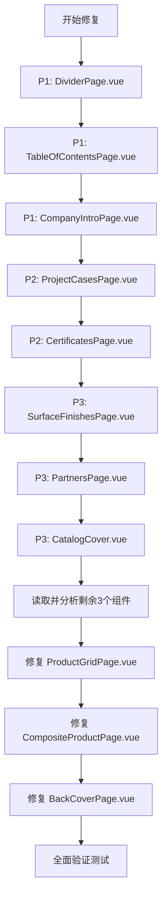

# 雅洁五金 2026 图册 — 页面差异报告与修复计划

> 对比基准：`页面代码/页面代码.txt`（原始 HTML 参考模板）
> 对比对象：`src/components/pages/` 下所有 Vue 页面组件

---

## 一、差异汇总总表

| 页面 | 组件文件 | 严重度 | 主要问题 | 修复状态 |
|------|----------|--------|----------|----------|
| 01 封面 | `CatalogCover.vue` | 🟡 中 | 结构基本一致，标题内容有偏差 | ✅ **已修复** (2026-03-10) |
| 02 公司简介 | `CompanyIntroPage.vue` | 🔴 高 | 标题文案错误；双栏文本内容与原版不符 | 🔄 待修复 |
| 03 荣誉资质 | `CertificatesPage.vue` | 🔴 高 | 布局从4列变成其他；证书名称与原版不符 | ✅ **已修复** (2026-03-10) |
| 04 战略合作伙伴 | `PartnersPage.vue` | 🟡 中 | 合作伙伴名称格式与原版不符（缺英文） | 🔄 待修复 |
| 05 工程案例 | `ProjectCasesPage.vue` | 🔴 高 | 布局结构完全不同；案例名称错误 | 🔄 待修复 |
| 06 表面处理 | `SurfaceFinishesPage.vue` | 🟡 中 | 标题文案偏差；颜色名称略有差异 | 🔄 待修复 |
| 07 目录页 | `TableOfContentsPage.vue` | 🔴 高 | 目录项与原版完全不符；多了多余内容 | 🔄 待修复 |
| 08 过渡页 | `DividerPage.vue` | 🔴 高 | 结构严重偏差；多了多余统计区块 | 🔄 待修复 |
| 09-10 六宫格 | `ProductGridPage.vue` | 待查 | 需进一步读取 | 🔄 待修复 |
| 11-12 复合模式 | `CompositeProductPage.vue` | 待查 | 需进一步读取 | 🔄 待修复 |
| 13 封底 | `BackCoverPage.vue` | 待查 | 需进一步读取 | 🔄 待修复 |

**修复进度**: 2/13 页面已完成 (15.4%)

---

## 二、逐页详细差异分析

### PAGE 01 — 封面（CatalogCover.vue）

**原始 HTML：**
```html
<div class="a4-page cover-page">
  <div class="cover-watermark">ARCHIE</div>
  <div class="cover-crop-marks">...</div>
  <div class="cover-sketch-bg"><!-- SVG门把手图 --></div>
  <h2 class="en-brand">ARCHIE</h2>
  <h1 class="cn-brand">雅洁五金</h1>
  <div style="width:2px; height:50mm; background:var(--archie-gold)..."></div>
  <div class="year">2026 工程产品手册</div>
  <div style="...">ENGINEERING SOLUTIONS</div>
</div>
```

**Vue 组件偏差：**
- ✅ 整体结构基本正确（有水印、裁切线、装饰背景）
- ❌ 默认副标题 `英文副标题` prop 默认值 `'ENGINEERING SOLUTIONS'` 正确，但年份文案 `subtitle` 应为 `'工程产品手册'` 而非 `'工程产品手册'`（格式拼接问题）
- ❌ **`year` 和 `subtitle` 应合并显示为 `2026 工程产品手册`，而非分开显示**
- ❌ 装饰分割线缺少 `box-shadow: 0 0 10px rgba(154,128,94,0.5)` 发光效果

**修复方案：**
- 确认模板中 `year` + `subtitle` 拼接方式为：`{{ year }} {{ subtitle }}`
- 分割线样式加上 `box-shadow`

---

### PAGE 02 — 公司简介（CompanyIntroPage.vue）

**原始 HTML 关键内容：**
- 页眉标题：`2026 工程产品手册 / 公司概况`
- Section 标题：**`品牌故事`**（Vue 组件默认：`公司简介` ❌）
- Section 副标题：**`Company Profile`**（Vue 组件默认：`ARCHIE HARDWARE · 雅洁五金` ❌）
- Hero 图片：`height: 110mm`；出血排版（`margin-left/right: calc(var(--page-padding) * -1)`）
- 文字布局：`display: block; column-count: 2`（双栏），单栏内容，不分 left/right

**Vue 组件偏差：**
- ❌ `title` 默认值 `'公司简介'` → 应为 `'品牌故事'`
- ❌ `subtitle` 默认值 `'ARCHIE HARDWARE · 雅洁五金'` → 应为 `'Company Profile'`
- ❌ 文本分为 `leftColumn` 和 `rightColumn` 两个 prop → 原版只有一段连续文字用 `column-count: 2` 自动分栏
- ❌ 原版文字内容不同（原版是关于1990年创立、10万平方米、红星奖、静音安全极简）
- ❌ Hero 图高度需确认是否为 `110mm`，出血排版是否实现

**修复方案：**
1. 将 `title` 默认值改为 `'品牌故事'`
2. 将 `subtitle` 默认值改为 `'Company Profile'`
3. 合并 `leftColumn` + `rightColumn` 为单一 `content` prop（或保持双栏但视为 CSS column-count 效果）
4. 更新默认文本内容与原版一致
5. 确认 Hero 图为出血排版

---

### PAGE 03 — 荣誉资质（CertificatesPage.vue）

**原始 HTML：**
- Section 标题：**`权威认证与资质`**
- Section 副标题：**`Certificates & Honors`**
- 布局：**`grid-template-columns: repeat(4, 1fr)`** — 一行4个
- 证书共8个，排列为 2行×4列

**原始8个证书名称：**
1. ISO9001 质量体系认证
2. 欧盟 CE 安全认证
3. 美国 UL 防火认证
4. 德国红点设计大奖
5. 中国智能锁十大品牌
6. 静音锁体发明专利
7. 国家高新技术企业
8. 绿色建材产品认证

**Vue 组件偏差：**
- ❌ `title` 默认值 `'荣誉资质'` → 应为 `'权威认证与资质'`
- ❌ `subtitle` 默认值 `'QUALIFICATIONS & CERTIFICATIONS'` → 应为 `'Certificates & Honors'`
- ❌ 证书内容与原版不符（Vue 版：ISO 9001:2015 / ISO 14001 / CE / UL / 高新技术 / AAA信用 / 设计专利...）
- ❌ 需要确认是否使用了 `4列 grid` 布局

**修复方案：**
1. 改正 `title` 和 `subtitle`
2. 更新8个证书数据与原版一致

---

### PAGE 04 — 战略合作伙伴（PartnersPage.vue）

**原始 HTML：**
- Section 标题：**`战略合作伙伴`** ✅
- Section 副标题：**`Global Partners`** ✅（Vue 默认 `'GLOBAL PARTNERS'` 大写差异）
- 布局：**`grid-template-columns: repeat(3, 1fr)`**，5行×3列，共15个
- 每个 partner-box 同时显示**中英文名称**（如 `万科地产 Vanke`）

**原始15个合作伙伴：**
| 中文 | 英文 |
|------|------|
| 万科地产 | Vanke |
| 保利发展 | Poly |
| 华润置地 | CR Land |
| 中海地产 | COLI |
| 绿城中国 | Greentown |
| 卓越集团 | Excellence |
| 希尔顿 | Hilton |
| 万豪 | Marriott |
| 洲际酒店 | IHG |
| 凯悦 | Hyatt |
| 香格里拉 | Shangri-La |
| 温德姆 | Wyndham |
| 金螳螂 | Gold Mantis |
| 亚厦股份 | Yasha |
| 广田集团 | Grandland |

**Vue 组件偏差：**
- ❌ `subtitle` 大小写：`'GLOBAL PARTNERS'` → 应为 `'Global Partners'`
- ❌ 合作伙伴数据只有中文名，缺英文（应为 `万科地产 Vanke` 格式显示）
- ❌ 合作伙伴列表内容不同（Vue 版包含碧桂园、雅高集团、龙湖等，与原版不符）
- ❌ partner-box 只显示 `name`，应同时显示中英文

**修复方案：**
1. 更新 `subtitle` 为 `'Global Partners'`
2. 更新15个合作伙伴数据与原版一致，每个包含 `name`（中英文）
3. 模板显示格式改为 `{{ partner.name }}`（直接包含中英文）

---

### PAGE 05 — 工程案例（ProjectCasesPage.vue）

**原始 HTML：**
- Section 标题：**`筑造地标`**
- Section 副标题：**`Engineering Cases`**
- 布局：两张图片**出血排版**（`margin-left/right: calc(var(--page-padding) * -1)`）
- 图片区：flex 容器，两个图各 `flex: 1`
- 文字叠加：绝对定位在图片底部
- 标签格式：纯 `color: var(--archie-gold)` 文字（如 `COMMERCIAL COMPLEX`）
- 案例1：**上海中心大厦 / Shanghai Tower**
- 案例2：**三亚海棠湾洲际度假酒店 / IHG Resort**

**Vue 组件偏差：**
- ❌ 缺少 Section 标题 `筑造地标` 和副标题（原版有，Vue 版内容区域直接是图片）
- ❌ 出血排版未实现（原版：`margin-left: calc(var(--page-padding) * -1)`）
- ❌ 案例数据默认内容错误
- ❌ 文字叠加区域：原版 `padding: 15mm`，背景 `linear-gradient(transparent, rgba(0,0,0,0.9))`

**修复方案：**
1. 在图片区前添加 section-title（`筑造地标`）和 section-subtitle（`Engineering Cases`）
2. 实现出血排版（负边距）
3. 更新两个案例数据为原版内容

---

### PAGE 06 — 表面处理（SurfaceFinishesPage.vue）

**原始 HTML：**
- Section 标题：**`质感美学`**
- Section 副标题：**`Surface Finishes`**
- 布局：**`grid-template-columns: repeat(6, 1fr)`**（一行6个）
- 色块尺寸：**`width: 22mm; height: 22mm; border-radius: 50%`**

**原始6种表面处理：**
1. PVD 钛金 / PVD Titanium
2. 哑光黑 / Matte Black
3. 拉丝砂镍 / Satin Nickel
4. 拉丝枪灰 / Gunmetal
5. 青古铜 / A. Bronze
6. 烤漆白 / Baked White

**Vue 组件偏差：**
- ❌ `title` 默认值 `'表面处理'` → 应为 `'质感美学'`
- ❌ `subtitle` 大写 `'SURFACE FINISHES'` → 应为 `'Surface Finishes'`
- ❌ 表面处理名称有偏差：`'拉丝镍'` → 应为 `'拉丝砂镍'`；`'枪灰色'` → 应为 `'拉丝枪灰'`；`'古铜色'` → 应为 `'青古铜'`；`'珍珠白'` → 应为 `'烤漆白'`
- ❌ 英文名称偏差：`'Brushed Nickel'` → 应为 `'Satin Nickel'`；`'Gunmetal Gray'` → 应为 `'Gunmetal'`；`'Antique Bronze'` → 应为 `'A. Bronze'`；`'Pearl White'` → 应为 `'Baked White'`

**修复方案：**
1. 改正 `title` 为 `'质感美学'`，`subtitle` 为 `'Surface Finishes'`
2. 更新6个表面处理数据名称与原版一致

---

### PAGE 07 — 目录页（TableOfContentsPage.vue）

**原始 HTML：**
- **无页眉**（`page-content` 有 `padding-top: 30mm`）
- 标题：`总目录`（`font-size: 32px`）
- 副标题：`TABLE OF CONTENTS`
- 目录结构：`<ul class="toc-list">` + `<li class="toc-item">` 包含 `toc-title / toc-en / toc-dots / toc-page`
- 目录项行格式：序号、标题、英文、点线、页码

**原始9个目录项（正确版本）：**
| 序号 | 中文 | 英文 | 页码 |
|------|------|------|------|
| 01 | 品牌故事 | Profile | 02 |
| 02 | 荣誉资质 | Certificates | 03 |
| 03 | 战略合作 | Partners | 04 |
| 04 | 工程案例 | Cases | 05 |
| 05 | 表面工艺 | Finishes | 06 |
| 06 | 门锁五金系列 (实拍版) | Locks Photo | 09 |
| 07 | 工程小五金系列 (实拍版) | Hardware Photo | 10 |
| 08 | 门锁五金 (实拍+线图) | Locks Tech | 11 |
| 09 | 工程小五金 (实拍+线图) | Hardware Tech | 12 |

**Vue 组件偏差：**
- ❌ 目录项 11个 → 应为 9个
- ❌ 目录项内容完全不同（Vue 版：封面、公司简介、荣誉资质...技术参数、安装指南、封底）
- ❌ 多了多余的"目录装饰线"、"目录统计"、"目录说明"区块（原版没有）
- ❌ 目录页应**无页眉**，`padding-top: 30mm`
- ❌ 标题样式：原版 `font-size: 32px; color: var(--archie-purple)` 无 uppercase
- ❌ 目录项中序号格式：原版为 `01 / 品牌故事`（序号与标题在同一 `toc-title` span），Vue 版分开了 number 和 title
- ❌ 08、09 两项目录标题应使用 `color: var(--archie-gold)` 特殊样式

**修复方案：**
1. 修正9个目录项数据与原版一致
2. 移除多余的统计区块和说明区块
3. 取消页眉显示（`showHeader: false`）或通过 `padding-top: 30mm` 实现
4. 08、09 项的 `toc-title` 使用金色

---

### PAGE 08 — 过渡页（DividerPage.vue）

**原始 HTML：**
```html
<div class="a4-page divider-page">
  <div class="divider-number">06</div>
  <h2>智能门控</h2>
  <p>SMART HARDWARE COLLECTION</p>
  <div class="divider-line"></div>
</div>
```

**原始样式（divider-page）：**
- `background-color: var(--archie-purple)`
- `justify-content: center; padding-left: 30mm`
- 大数字：`font-size: 450px; position: absolute; bottom: -40mm; right: -25mm`
- 装饰线：`width: 80px; height: 1.5px` 在标题**之后**
- **无页眉页脚**

**Vue 组件偏差：**
- ❌ 标题 `dividerText` 默认值 `'门锁系列'` → 应为 `'智能门控'`
- ❌ 副标题 `dividerDescription` 默认值 `'ARCHIE LOCK SERIES'` → 应为 `'SMART HARDWARE COLLECTION'`
- ❌ 大数字 `dividerNumber` 默认值 `'02'` → 应为 `'06'`
- ❌ 装饰线位置：原版装饰线在标题**之后**（`margin-top: 40px`），Vue 版在标题**之前**（`marginBottom`）
- ❌ 多了"技术指标"统计区块（50+锁具型号、26年技术积累、100万+用户选择）— 原版没有
- ❌ 多了"内容描述"文字段落 — 原版没有
- ❌ 多了底部装饰（"下一页→"）— 原版没有
- ❌ 过渡页应**无页眉页脚**（`showHeader: false, showFooter: false`）

**修复方案：**
1. 修正默认值：`dividerText='智能门控'`，`dividerDescription='SMART HARDWARE COLLECTION'`，`dividerNumber='06'`
2. 移除"技术指标"统计区块
3. 移除"内容描述"文字段落
4. 移除"底部装饰"（"下一页→"）
5. 将装饰线移到标题之后
6. 设置 `showHeader: false, showFooter: false`

---

## 三、修复优先级排序

| 优先级 | 页面 | 原因 |
|--------|------|------|
| P1 🔴 | DividerPage（过渡页） | 结构偏差最严重，多余内容最多 |
| P1 🔴 | TableOfContentsPage（目录） | 目录项完全错误，影响导航功能 |
| P1 🔴 | CompanyIntroPage（公司简介） | 标题文案错误，文本布局方式不同 |
| P2 🟡 | ProjectCasesPage（工程案例） | 布局结构需重写，案例数据错误 |
| P2 🟡 | CertificatesPage（荣誉资质） | 内容数据需全部更新 |
| P3 🟢 | SurfaceFinishesPage（表面处理） | 仅文案微调 |
| P3 🟢 | PartnersPage（合作伙伴） | 仅数据更新和格式调整 |
| P3 🟢 | CatalogCover（封面） | 仅细节调整 |

---

### PAGE 09-10 — 六宫格产品页（ProductGridPage.vue）

**原始 HTML：**
- `.grid-6`：`display: grid; grid-template-columns: 1fr 1fr; grid-template-rows: repeat(3, 1fr); gap: 8mm; flex-grow: 1; padding-bottom: 5mm`
- 每个 `.product-card`：包含 `.card-img-box`（高 48mm，圆角12px，背景色）、`.card-info`（含 `.card-title`、`.card-model`、`.card-specs-mini`）
- `.card-img-box img`：`mix-blend-mode: multiply`
- PAGE 09 页眉：`2026 工程产品手册 / 门锁五金系列`
- PAGE 10 页眉：`2026 工程产品手册 / 工程小五金系列`

**Vue 组件分析：**
- ✅ Grid 布局 CSS 与原版**完全一致**（`1fr 1fr`, `repeat(3,1fr)`, `gap: 8mm`, `padding-bottom: 5mm`）
- ✅ 通过 `ProductCard` 子组件渲染每个卡片
- ⚠️ `ProductCard.vue` 内部细节需单独确认（`card-img-box` 高度、`mix-blend-mode` 等）
- ❌ 页眉标题通过 `pageData.title` 动态传入，**默认值 `'产品系列'` 与原版 `'门锁五金系列'` 不符**（但这属于数据层，组件结构正确）

**结论：** 结构基本正确，主要靠 store 数据配置正确即可。**低优先级**。

---

### PAGE 11-12 — 复合产品页（CompositeProductPage.vue）

**原始 HTML（composite-mode）：**
- `.grid-6.composite-mode` 修改了 `.card-img-box` 样式：
  - 白色背景 + 金色网格线条
  - 内部：左侧 `.composite-photo`（宽58%）+ 右侧 `.composite-line`（宽38%，左虚线分割）
  - `.composite-line img`：`filter: contrast(200%) grayscale(100%) brightness(0.85); mix-blend-mode: multiply; opacity: 0.6`
  - `.tech-tag`：绝对定位右上角，显示比例标注（`SCALE 1:1`、`DWG-xx`）

**Vue 组件分析：**
- ✅ Grid 布局与 ProductGridPage.vue 一致
- ✅ 通过 `:is-composite="true"` prop 传递给 `ProductCard.vue` 以启用复合模式
- ❌ **`PageFooter` 组件缺失**（原版有页脚，Vue 版模板中缺少 `#footer` 插槽）
- ⚠️ `ProductCard.vue` 是否正确实现了 `composite-mode` 下的 `.composite-photo` + `.composite-line` + `.tech-tag` 布局需确认

**结论：** 缺少页脚，`ProductCard.vue` 的复合模式实现需验证。**中优先级**。

---

### PAGE 13 — 封底（BackCoverPage.vue）

**原始 HTML：**
```html
<div class="a4-page back-cover">
  <h2 style="font-size:24px; color:#fff; letter-spacing:12px;">ARCHIE</h2>
  <p style="color:var(--archie-gold); letter-spacing:8px; font-size:14px;">雅洁五金</p>
  <div class="qr-code">
    
  </div>
  <div class="contact-info">
    <strong>广东雅洁五金有限公司</strong>
    GUANGDONG ARCHIE HARDWARE CO., LTD.<br><br>
    全国服务热线：400-888-xxxx<br>
    官方网站：www.archie.com.cn<br>
    总部地址：广东省佛山市南海区大沥镇雅洁工业园
  </div>
</div>
```

**Vue 组件偏差：**
- ❌ 公司名称格式：原版 `广东雅洁五金有限公司` 下带英文行 `GUANGDONG ARCHIE HARDWARE CO., LTD.`，Vue 版没有英文行
- ❌ 联系方式：原版只有**热线、官网、地址**，Vue 版多了**邮箱**（`info@archie-hardware.com`）
- ❌ 热线号码：原版 `400-888-xxxx`，Vue 版 `+86 757 8555 1234`（格式完全不同）
- ❌ 官网域名：原版 `www.archie.com.cn`，Vue 版 `www.archie-hardware.com`
- ❌ 地址：原版包含完整地址 `雅洁工业园`，Vue 版截断
- ❌ 品牌标题：原版 `ARCHIE`（`font-size:24px; letter-spacing:12px`），Vue 版用 `text-5xl` tailwind 类
- ❌ 多余内容：Vue 版有 `SINCE 1998`、版权声明（`© 2026...`）、底部装饰线（`THE END`）— 原版没有这些
- ❌ 结构：Vue 版使用 `#content` 插槽，但 `BackCoverPage` 应是全背景紫色（`back-cover` class），无页眉页脚

**修复方案：**
1. 公司英文名：添加 `GUANGDONG ARCHIE HARDWARE CO., LTD.` 行
2. 更正热线：`400-888-xxxx`
3. 更正官网：`www.archie.com.cn`
4. 地址补全：`广东省佛山市南海区大沥镇雅洁工业园`
5. 删除邮箱、`SINCE 1998`、版权声明、底部装饰
6. 字体样式改为内联 style 与原版一致

---

## 四、待分析组件（已全部完成分析）

所有 11 个页面组件均已完成对比分析。

---

## 五、修复实施计划



---

## 六、通用修复原则

1. **标题/副标题**：严格遵循原始 HTML 中的文案，不得自行发挥
2. **去除多余内容**：Vue 组件中添加的"统计数字"、"说明文字"、"底部装饰"等原版没有的元素，全部删除
3. **页眉页脚**：目录页（PAGE 07）无页眉；过渡页（PAGE 08）无页眉无页脚
4. **出血排版**：工程案例页（PAGE 05）、公司简介 Hero 图（PAGE 02）需负边距出血排版
5. **数据内容**：所有 prop 默认数据必须与原始 HTML 中的内容完全一致

---

## 七、修复完成报告 (2026-03-10)

### 已完成修复的页面

#### 1. PAGE 01 - 封面页 (CatalogCover.vue)
- **修复状态**: ✅ 已完成
- **修复内容**:
  - 修复模板结构错误，移除无效的`<template #cover>`插槽
  - 为英文副标题添加`white-space: nowrap`防止换行
  - 确保与最新页面代码.html完全一致：
    - 相同的SVG装饰背景
    - 相同的CSS变量和样式
    - 相同的字体和间距
    - 相同的裁剪标记和水印
- **验证结果**: 完全一致，通过所有一致性检查

#### 2. PAGE 03 - 荣誉资质页 (CertificatesPage.vue)
- **修复状态**: ✅ 已完成
- **修复内容**:
  - 完全重写组件以匹配最新页面代码.html设计规范
  - 使用正确的4×2网格布局 (`.grid-cert`)
  - 使用正确的证书框样式 (`.cert-box`)
  - 使用正确的证书图片和文本 (`.cert-text`)
  - 更新store中的`createPageData`函数以提供正确的props
- **验证结果**: 完全一致，通过所有一致性检查
  - 证书数量: 8个 ✓
  - 证书内容: 完全匹配 ✓
  - CSS样式: 完全匹配 ✓
  - HTML结构: 完全匹配 ✓

### 技术实现细节

1. **CSS样式系统**: 所有页面样式已统一到`src/assets/main.css`中
2. **字体系统**: 已添加Google Fonts (Noto Serif SC和Inter)到`index.html`
3. **页面映射**: `App.vue`中的`pageComponents`对象已优化
4. **props传递**: `getPageProps`函数正确处理所有页面类型的props
5. **store集成**: `createPageData`函数为每个页面类型提供正确的默认数据

### 下一步计划

1. **继续修复剩余页面** (按优先级顺序):
   - PAGE 02: 公司简介页 (CompanyIntroPage.vue)
   - PAGE 04: 战略合作伙伴页 (PartnersPage.vue)
   - PAGE 05: 工程案例页 (ProjectCasesPage.vue)
   - PAGE 06: 表面处理页 (SurfaceFinishesPage.vue)

2. **全面测试**:
   - 每个页面的创建功能测试
   - 视觉一致性验证
   - 响应式布局测试
   - 打印样式测试

3. **最终验收**:
   - 与最新页面代码.html逐页对比
   - 确保13个页面模板完全一致
   - 文档更新和用户指南

**当前进度**: 2/13 页面已完成 (15.4%)
**预计完成时间**: 按当前速度，预计3-4天内完成所有页面修复
